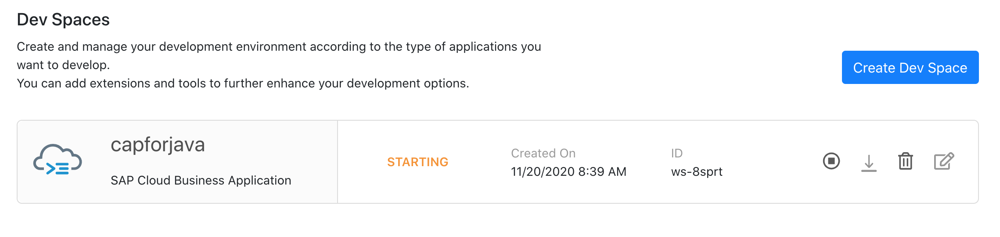
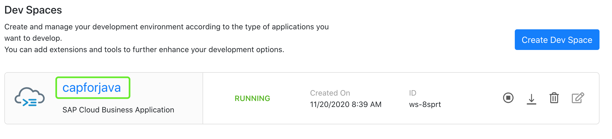
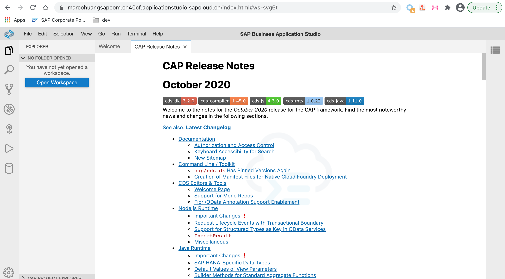
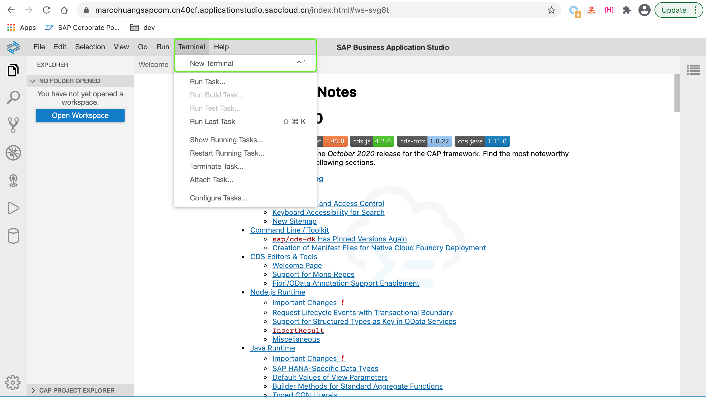
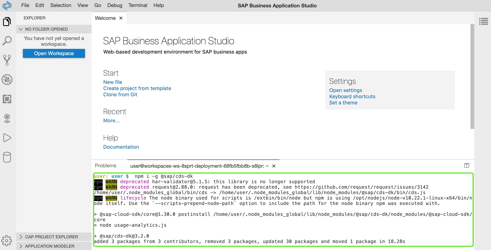
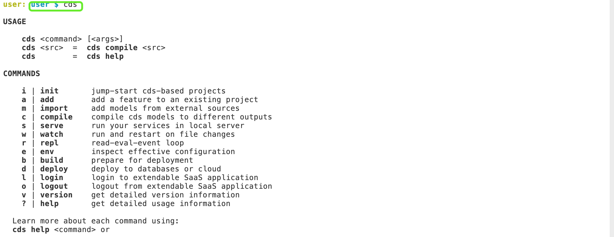

# 02-配置SBAS开发环境

## 章节目标

通过本章节，您将完成以下内容：

- 在SBAS中创建工作区间
- 在SBAS中配置CAP工作环境

## 创建工作区间

在上一章节中，您已能够成功访问SBAS主页，现在通过`Create Dev Space`按钮，创建一个工作区间。工作区间内您可以创建多个项目，在创建工作区间同时，您可以选择该工作区间可以使用哪些插件，不同插件集成了相对应的SAP的产品功能。

:point_right: 点击`Create Dev Space`，输入工作区间名称，在左侧条目中选择`SAP Cloud Business Application`,同时在右侧插件栏中勾选插件`CDS Graphical Modeler`。点击`Create Dev Space`开始创建具备新建SAP CAP类型应用能力的工作区间。


系统将会花几分钟时间为您开始创建包含对应插件的工作区间。此时工作区间标题显示为橙色，表示正在创建中。



:point_right: 系统创建完成之后，工作区间名称将由橙色变为绿色，此时可点击工作区间名称(在本例中工作区间标题为`capforjava`)进入工作区间。



在SBAS工作区间中，您可以获取关于CAP的最新特性，通过各个栏目的链接，您可以查找更多关于CAP的功能点。



至此我们已完成工作区间的创建，接下来我们将开始配置工作环境。

## 配置CAP工作环境

SBAS工作区间可被理解为具备网络访问能力的虚拟化资源，我们在开始创建CAP应用之前，我们需要为该工作区间安装配置CAP所必需的工作环境。

:point_right: 菜单栏中依次选择`Terminal > New Terminal`开启一个命令行终端。



### 安装NodeJS

默认情况下SBAS会为每个创建好的工作区间预安装NodeJS，您也可以选择卸载已安装的NodeJS，重新[安装](https://nodejs.org/en/)您所需要的版本。
同时SBAS默认为您安装了其他工具套件，比如Apache Maven等。

### 安装CDS命令行工具

默认情况下，新建的工作区间(在勾选`SAP Cloud Business Application`选项的情况下)已经预先安装好了`cds`所需要的依赖包，您无需再次安装cds依赖包。当然您也可以通过命令`npm i -g @sap/cds-dk`手动重新安装cds依赖包。

安装效果如下图所示：



在终端命令行中键入`cds`命令之后，控制台会出现cds的帮助信息，表示cds的依赖已经安装成功。

```sh
cds # 测试cds命令行工具是否安装成功
```



至此，我们已完成SBAS中CAP工作环境的配置。现在您可以进入[03-创建CAP基础应用](https://github.tools.sap/sap-samples-scpcn/teched-2020-12-15/blob/master/exercises/03/README.md)章节开始创建SAP CAP应用。