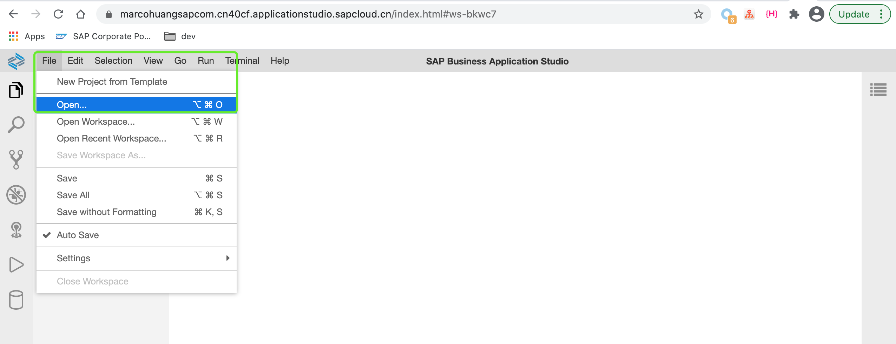
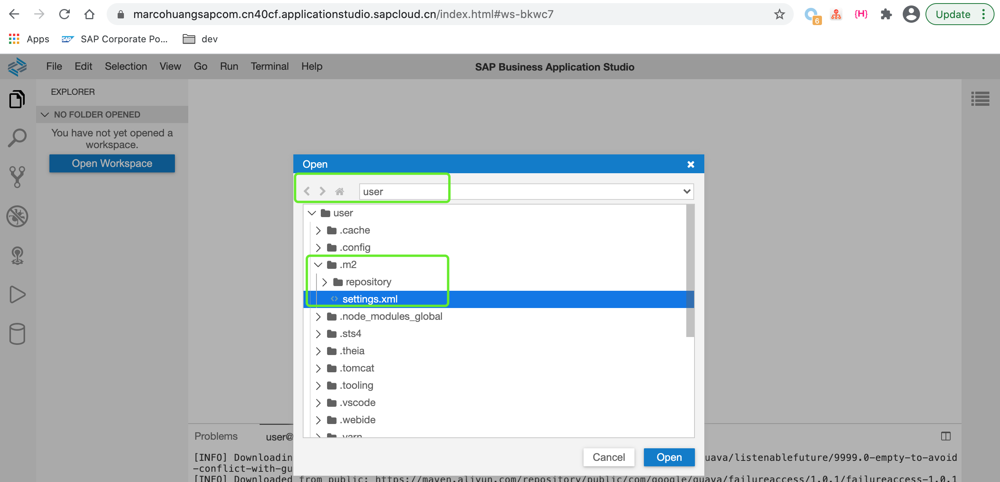
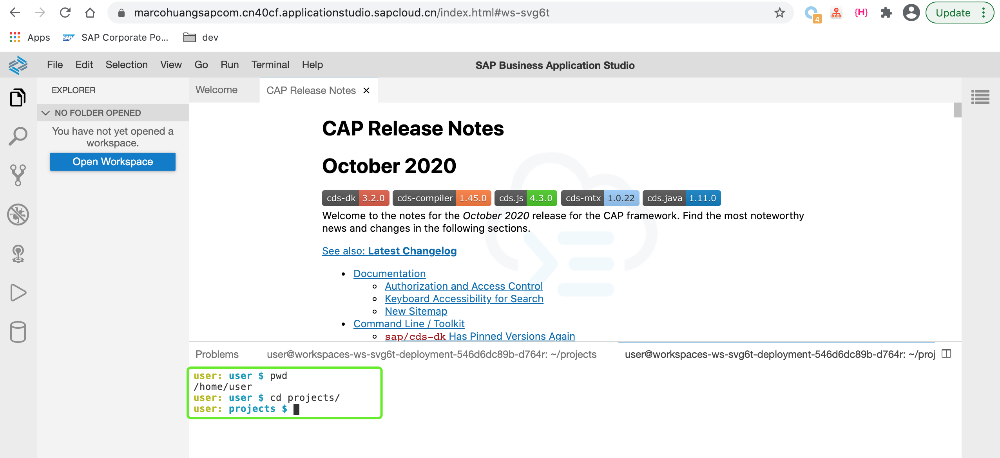
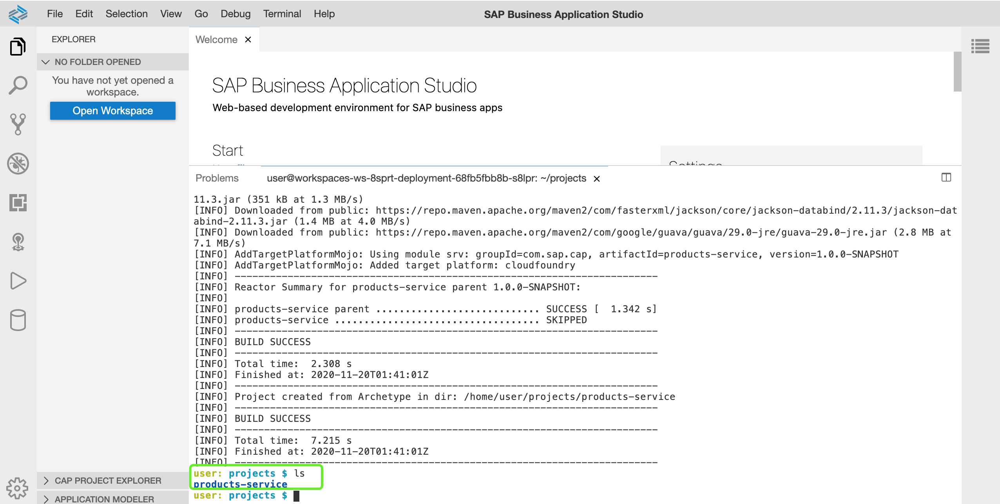
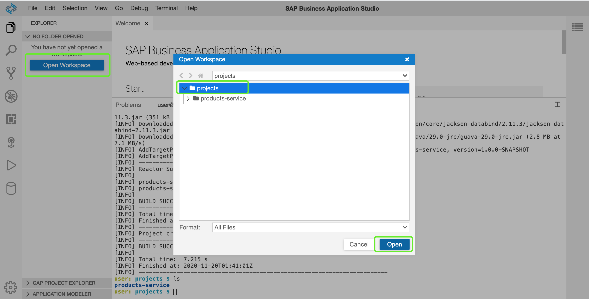
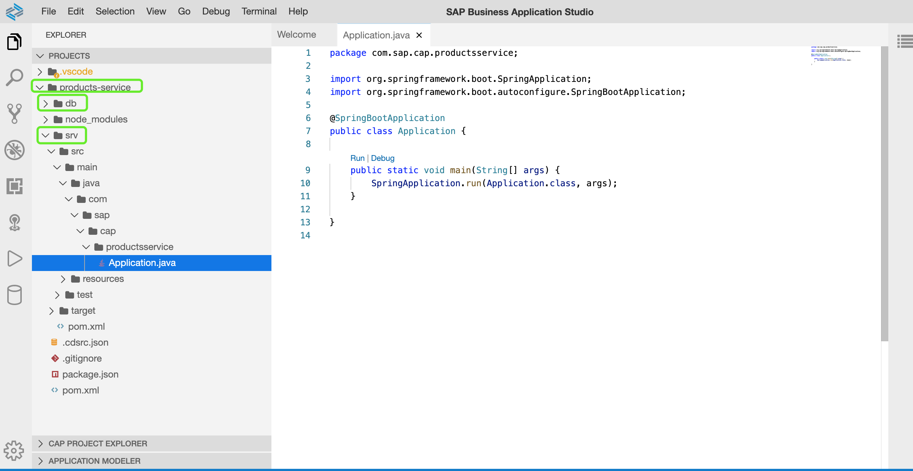

# 03-创建CAP应用

## 章节目标

经过本章节，您将完成以下内容：

- 创建一个CAP应用

## 更改maven配置

为了加快创建CAP应用的速度，当前情况下建议修改SBAS工作区间的maven配置，使其从阿里云的镜像中心下载相关镜像或者maven依赖。

:point_right: 点击`File > Open...`打开文件管理窗口。



:point_right: 选择如下图指定路径打开maven配置文件`settings.xml`:



:point_right: 使用如下内容覆盖原先的maven配置，以便从阿里云的maven镜像中心拉取应用所需的依赖。

```xml
<?xml version="1.0" encoding="UTF-8"?>
<settings xsi:schemaLocation="http://maven.apache.org/SETTINGS/1.1.0 http://maven.apache.org/xsd/settings-1.1.0.xsd" xmlns="http://maven.apache.org/SETTINGS/1.1.0"
    xmlns:xsi="http://www.w3.org/2001/XMLSchema-instance">
  <!--localRepository>/home/vcap/app/.java-buildpack/tomcat/temp/maven_repo_2172626517096829188</localRepository-->
  <interactiveMode>false</interactiveMode>
  <mirrors>
    <mirror>
    <id>aliyunmaven</id>
    <mirrorOf>central</mirrorOf>
    <name>aliyun maven</name>
    <url>https://maven.aliyun.com/repository/public </url>
    </mirror>
  </mirrors>
  <profiles>
    <profile>
      <repositories>
        <repository>
          <id>public</id>
          <url>https://maven.aliyun.com/repository/public</url>
        </repository>
    </repositories>
      <pluginRepositories> 
        <pluginRepository>
          <id>public</id>
          <url>https://maven.aliyun.com/repository/public</url>
        </pluginRepository>
      </pluginRepositories>
      <id>public</id>
    </profile>
  </profiles>
  <activeProfiles>
    <activeProfile>public</activeProfile>
  </activeProfiles>
    <proxies>
        <proxy>
            <id>ws-proxy</id>
            <active>true</active>
            <protocol>http</protocol>
            <host>127.0.0.1</host>
            <port>8887</port>
                <nonProxyHosts>*.maven.apache.org|*.npmjs.org|*.npm.sap.com|nodejs.org</nonProxyHosts>
        </proxy>
    </proxies>
</settings>
```

## 创建CAP应用

### 进入工作目录

SBAS默认为用户创建了`projects`目录，现在我们在已打开的终端中跳转进入该目录。

:point_right: 在终端命令行中，跳转到`projects`目录。



### 创建项目

:point_right: 在终端命令行中执行以下命令创建一个CAP应用:

```sh
mvn -B -X -DarchetypeCatalog=internal archetype:generate -DarchetypeArtifactId=cds-services-archetype -DarchetypeGroupId=com.sap.cds \
-DarchetypeVersion=RELEASE \
-DgroupId=com.sap.cap -DartifactId=products-service -Dpackage=com.sap.cap.productsservice
```

**注意**: 您也可以自定义maven相关的profile名称，比如package name, group id等。在这里我们即将创建artifact id为`products-service`的项目。第一次创建会下载应用相关依赖，这个步骤预计会花费较长时间。

- `-X`选项开启maven的debug日志
- `-DarchetypeCatalog=internal`选项默认使用工作区间所在的虚机本地的`archetype-catalog.xml`文件

查看projects目录，发现名为`products-service`的项目应用已被成功创建。



### 打开workspace

:point_right: 在左侧面板中，点击`Open Workspace`，选择到`projects目录`,点击`Open`按钮打开该目录并作为workspace. 此步骤类似于VSCode中的`Add Folder to Workspace`。系统将会重新刷新整个网页以加载显示选择的workspace。



## 查看CAP应用

通过上面的maven命令我们创建所创建的CAP项目包含以下目录：

| 目录   |     介绍      |
|----------|-------------:|
| db | 包含[cds model](https://cap.cloud.sap/docs/cds/),可理解为实体类层 |
| srv | Java应用层，包含Java代码，也可包含CDS Service文件，提供服务 |



您可以点击查看项目中的其他文件，了解项目结构。

至此我们已完成创建一个CAP基础应用，接下来您将进入[04-定义CAP Service](https://github.com/HuangMarco/teched-2020-sap-cap/blob/master/exercises/04/README.md)