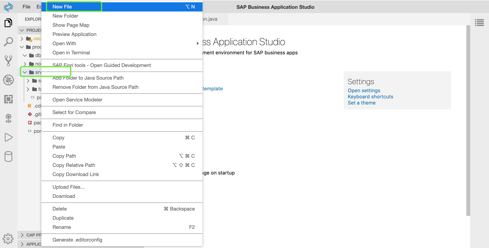
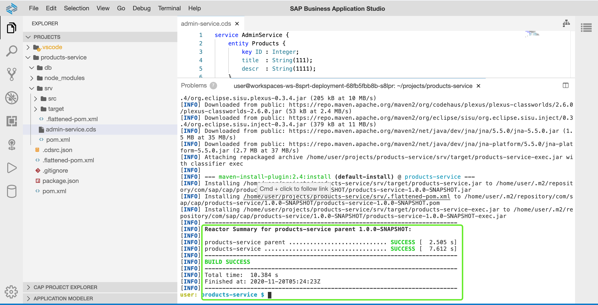
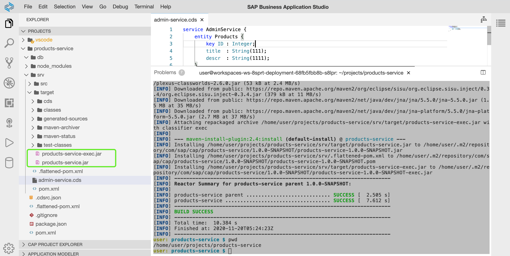
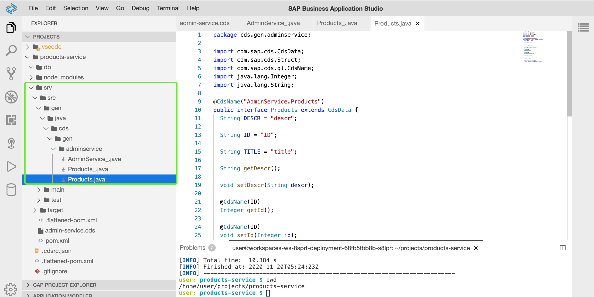
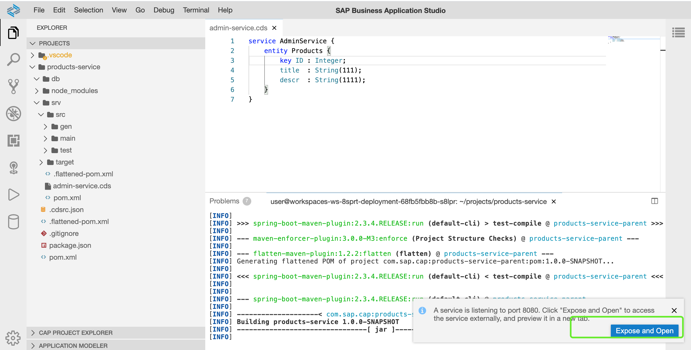
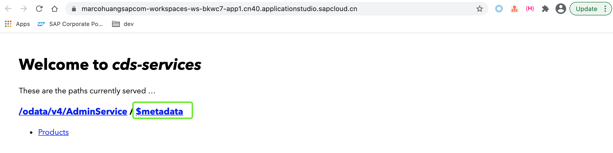
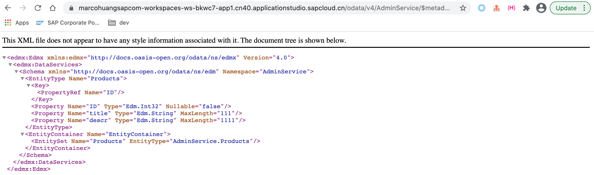
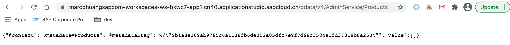

# 04-定义CAP Service

## 章节目标

在本章节中，您将完成以下内容：

- 声明创建CDS Service，并在其中创建实体对象
- 编译并运行CAP应用，查看应用对外暴露的服务
- 通过浏览器访问实体对象元数据
- 通过浏览器访问应用中的实体数据

## 创建CDS Service

一个CDS Service可以用来：

- 定义[CDS Entity](https://cap.cloud.sap/docs/cds/cdl#entities-views)
- 声明数据如何能够被消费

:point_right: 在左侧项目面板中，**右键**点击**srv > New File**，在弹出窗口中输入`admin-service.cds`



:point_right: 默认情况下，SBAS会以图形界面编辑器打开`.cds`结尾的文件。请先关闭图形界面编辑器，重新右键点击`admin-service.cds`文件，同时选择`Open with > Code Editor`, 在`admin-service.cds`中输入以下内容创建名为`AdminService`的CDS Service和实体对象`Products`。

```yaml
service AdminService {
    entity Products {
        key ID : Integer;
        title  : String(111);
        descr  : String(1111);
    }
}
```

## 编译CAP应用

在新打开的终端命令行中，进入到`products-service`项目根目录，执行命令`mvn clean install`

```sh
user: products-service $ pwd
/home/user/projects/products-service
user: products-service $ mvn clean install

```



查看左侧项目目录可以发现：在target/目录下新生成了products-service.jar。



查看左侧项目目录`srv/src/gen/`目录下生成了与实体对象`Products`对应的`Products.java`文件



## 运行CAP应用

在新打开的终端命令行中，进入`products-service`根目录，运行以下命令运行CAP应用：

```sh
cd ~/projects/products-service
mvn clean spring-boot:run
```

:point_right: 请认真观察控制台打印的信息，并关注窗口右下角是否会弹出窗口，如下图所示：



### 查看实体对象元数据

CAP应用首先会被编译，编译完成之后，SBAS会弹出对话框提示您输入希望应用暴露的端口，接着SBAS会新建一个浏览器标签页来访问该应用。

:point_right: 点击`Expose and Open`,在弹出的窗口后`Enter`键(选择默认分配暴露应用服务的端口)，浏览器会新建标签页面如下：



:point_right: 点击该标签页面中的`$metadata`链接，查看结果



如上图所示，通过定义一个CDS Service，我们在其中定义实体对象，CAP SDK会自动的将我们的对象转换为对应的Java对象。同时暴露的CAP对象可以通过[OData](https://www.odata.org/)的方式被用户访问。

### 查看数据

:point_right: 点击浏览器后退按钮，回退到应用访问的初始页面，点击`Products`链接查看访问结果：



通过访问实体对象数据，我们发现当前应用中实体对象的数据为空。

至此，我们已在CAP应用中创建CDS Service并在其中定义实体对象，通过暴露CAP应用，可以通过RESTFUL方式访问该实体对象的元数据信息。同时我们可以通过REST API的方式来访问CAP所暴露的服务。接下来您可以前往章节[05-添加自定义业务逻辑](https://github.tools.sap/sap-samples-scpcn/teched-2020-12-15/blob/master/exercises/05/README.md)来对当前应用做进一步的增强。