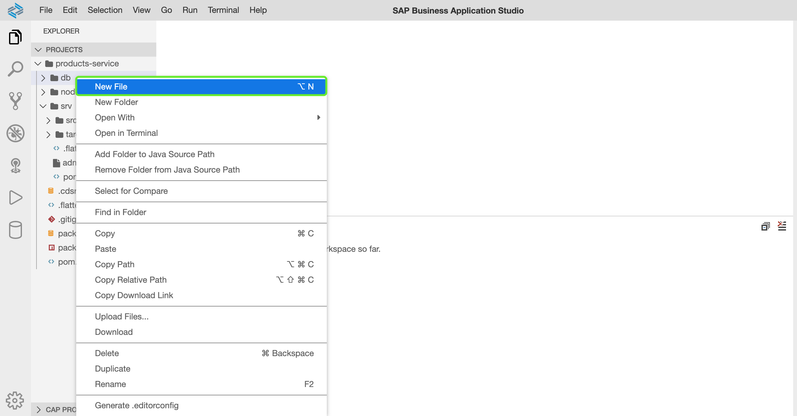
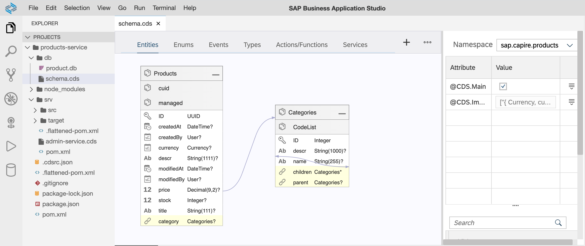
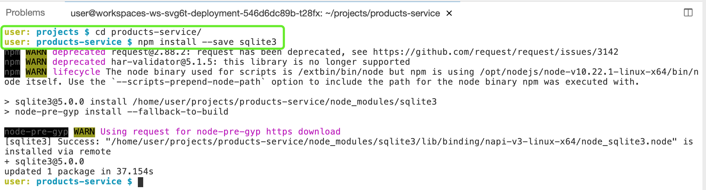
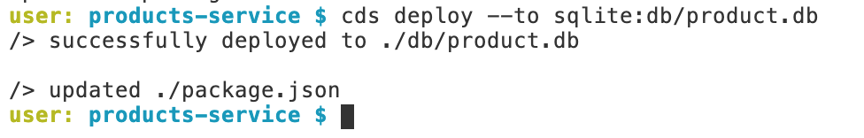
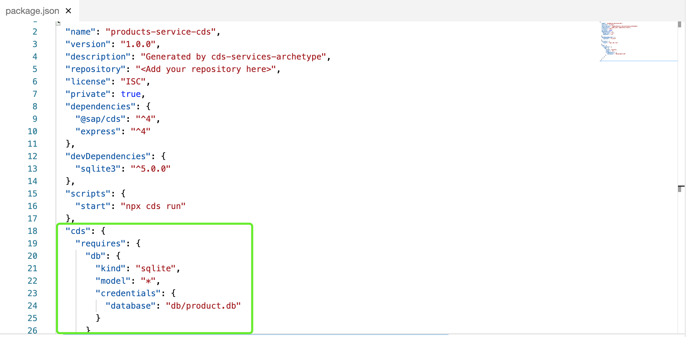
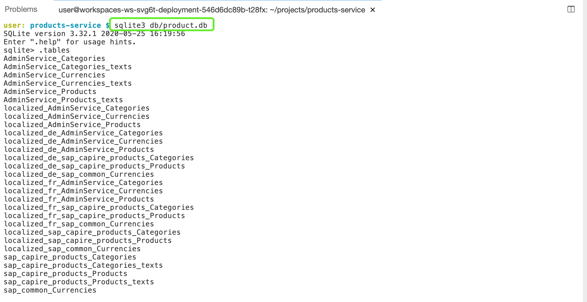
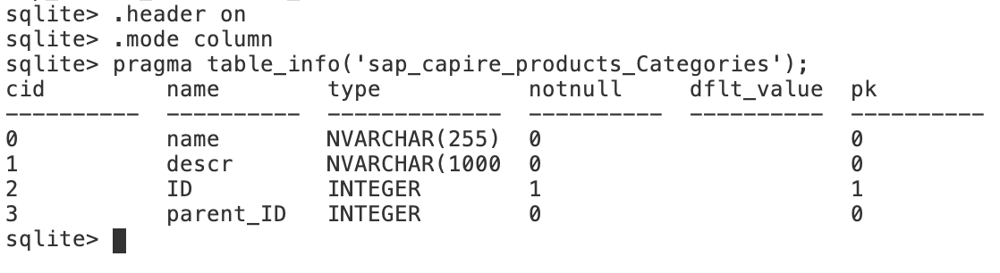
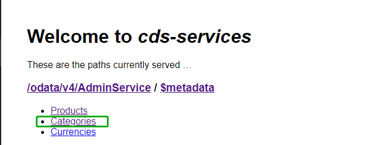
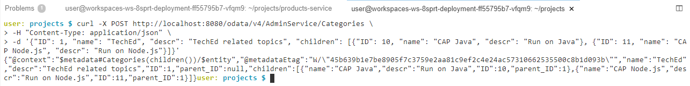
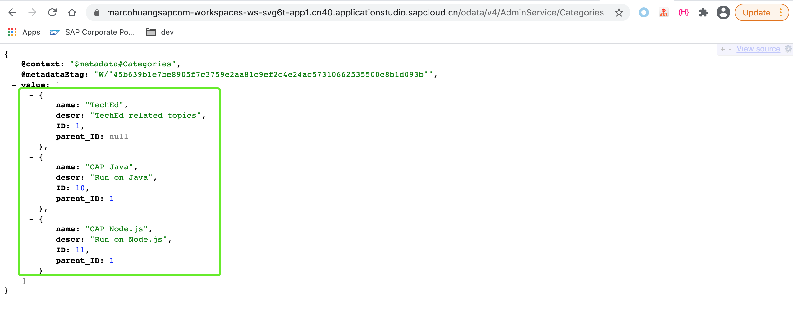

# 06-新建实体层以及重用CDS通用特性

通过上一章节，您已完成创建自定义Event Handler并添加增与读的功能。

## 本章目标

通过本章节，您将完成以下内容：

- 重新定义实体层，并统一放置所有实体在持久层中
- 新增实体Categories，并重用CDS通用属性
- 使用CDS annotation和association
- 重用CAP应用

## 重新定义Data Model

在之前章节中我们在CDS Service中同时创建了Service和实体对象Products，在实际的开发中，并不会将实体对象和Service对象放置在同一处，现在我们即将对CAP应用进行优化。

:point_right: 在SBAS左侧面板中右键点击`db`> `New File`，在弹出窗口中输入新建文件名称为`schema.cds`



在`schema.cds`文件中，输入以下内容：

```sql
namespace sap.capire.products;

using {
    Currency,
    cuid,
    managed,
    sap.common.CodeList
} from '@sap/cds/common';

entity Products : cuid, managed {
    title    : localized String(111);
    descr    : localized String(1111);
    stock    : Integer;
    price    : Decimal(9, 2);
    currency : Currency;
    category : Association to Categories;
}

entity Categories : CodeList {
    key ID       : Integer;
        parent   : Association to Categories;
        children : Composition of many Categories
                       on children.parent = $self;
}

```

### CDS Editor查看schema.cds

在SBAS中，所有后缀名为`*.cds`的文件，SBAS默认为其提供了插件`Graphical CDS Editor`来访问该类型的文件。

:point_right: 右键点击`schema.cds`，选择`Open with CDS Editor`



## 关于CDS Data Model

关于新创建的data model文件`schema.cds`：

- 该data model中包含2个entity，分别为`Products`和`Categories`
- 该data model中引入了`Currency`, `cuid`, `managed`, `CodeList`等cds通用类型，这些通用类型都包含在@sap/cds/common依赖中
- 在创建的data model中使用了`localized`, `Composition`, `Association`等关键字

### localized

`localized`用于标识哪些字段需要做国际化，CDS会针对于多语言环境自动进行翻译。

### Associations和Compositions

`Associations`和`Compositions`可以不通过使用外键的情况下定义实体与实体之间的关系。

- `Associations`用于定义实体之间松散的关系
- `Compositions`用于定义实体之间更深层次的关系，比如包含、继承等。在本例中，通过`Compositions`构建了实体`Categories`中，`children`与`parent`之间的包含关系

### cuid和managed关键字

- cuid用于向实体添加字段ID，其类型为uuid
- managed用于用于向实体添加4个额外的字段，分别为：创建日期时间、最后一次实体更新日期时间、创建实体记录的用户、最后一次更新实体记录的用户

### CodeList和Currency

- CodeList用于存储实体中的字段的全局翻译或者注释，比如国家、货币、语言种类等。
- Currency货币种类。与CDS内置的currencies实体关联

更多关于如何查看这些类型的标注，可在SBAS或本地IDE(例如VSCode)中下载@sap/cds/common依赖，然后在按下`CTRL`键的同时，将鼠标放置在对应字段上查看其标注。


## 重写AdminService

当我们将实体重新定义在db/schema.cds中之后，我们是时候将原本定义在AdminService中的Products实体类去除，同时在AdminService中引用在db/schema.cds中的Products实体类。

:point_right: 更新`srv/admin-service.cds`内容如下：

```yaml
using { sap.capire.products as db } from '../db/schema';

service AdminService {
    entity Products   as projection on db.Products;
    entity Categories as projection on db.Categories;
}
```

## 部署domain model

在定义好了实体层之后，我们即将将实体映射到数据库。在这里我们选用一个轻量级数据库[SQLite](https://www.sqlite.org/index.html)，该数据库常用于本地开发测试。

### 更新依赖

:point_right: 更新`packages.json`内容增加依赖`"sqlite3": "^5.0.0"`，同时新增`cds`部分配置项如下：

```json
{
  "name": "products-service-cds",
  "version": "1.0.0",
  "description": "Generated by cds-services-archetype",
  "repository": "<Add your repository here>",
  "license": "ISC",
  "private": true,
  "dependencies": {
    "@sap/cds": "^4",
    "express": "^4",
    "sqlite3": "^5.0.0"
  },
  "devDependencies": {
    "sqlite3": "^5.0.0"
  },
  "scripts": {
    "start": "npx cds run"
  },
  "cds": {
      "requires": {
          "db": {
              "kind": "hana"
          }
      }
  }
}
```

### 在SBAS中安装SQLite3依赖

在SBAS的terminal中运行以下命令：

```sh
npm uninstall sqlite3
npm install --save sqlite3
```



### 部署data model到sqlite数据库

:point_right: 执行以下命令将data model部署到sqlite数据库中：

```sh
#您也可以自定义生成目标db的路径
cds deploy --to sqlite:db/product.db #在db目录下生成product.db
```



### 查看部署效果

:point_right: 查看左侧项目面板中新生成的product.db


:point_right: 查看`package.json`是否有变动



### 查看sqlite中的数据库表

:point_right: 在终端命令行中，在`products-service`项目根目录下，执行以下命令访问sqlite数据库：

```sh
user: products-service $ sqlite3 db/product.db 
# 输入.tables查看所有的数据库表
sqlite> .tables
```



可以发现，在sqlite数据库中创建了与实体对应的数据库表：sap_capire_products_Categories等

### 查看数据库表的字段

:point_right: 通过如下命令查看表`sap_capire_products_Categories`中的字段：

```sh
sqlite> .header on
sqlite> .mode column
sqlite> pragma table_info('sap_capire_products_Categories');
```



**注意**:通过`CTRL + D`退出sqlite命令行界面

## 配置整个CAP应用使用sqlite数据库

前面步骤，我们已经将实体映射到了sqlite数据库，现在是时候让整个应用使用sqlite数据库来存取数据

:point_right: 在目录`srv/src/main/resources/`中打开`application.yaml`，更新url项为：

```yaml
---
spring:
  profiles: default
  datasource:
    url: "jdbc:sqlite:/home/user/projects/products-service/db/product.db"
    driver-class-name: org.sqlite.JDBC
    initialization-mode: never
    hikari:
      maximum-pool-size: 1
```

- 更新`datasource/url`，使其指向**上一步骤生成的sqlite数据库的地址**,在本例中为`/home/user/projects/products-service/db/product.db`
- 更新initialization-mode,关闭初始化模式，因为我们在之前步骤中已经初始化过实体并映射到sqlite数据库

## 启动并测试CAP应用

:point_right: 在**应用根目录**执行以下命令再次启动CAP应用：

```sh
mvn spring-boot:run
```

点击右下角弹出的服务运行提示窗口中的按钮`Open in New Tab`，以打开新的浏览器标签访问CAP应用。

:point_right: 在元数据页面中，分别点击页面上的所有链接，查看结果;点击`Categories`查看Categories实体是否有数据存在



### 插入数据

:point_right: 打开新的终端命令行,在新的终端命令行中执行以下命令为实体Categories插入数据：

```sh
curl -X POST http://localhost:8080/odata/v4/AdminService/Categories \
-H "Content-Type: application/json" \
-d '{"ID": 1, "name": "TechEd", "descr": "TechEd related topics", "children": [{"ID": 10, "name": "CAP Java", "descr": "Run on Java"}, {"ID": 11, "name": "CAP Node.js", "descr": "Run on Node.js"}]}'
```



### 查看Categories数据

:point_right: 再次点击`Categories`链接，查看Categories实体是否有数据。



:point_right: 在运行CAP应用的终端命令行中，通过`CTRL + C`强行停止CAP应用，之后再次运行命令`mvn spring-boot:run`重启应用;应用启动之后，再次访问`Categories`实体查看数据。

由上图可见，即使我们重启应用，我们之前插入的数据依然存在sqlite数据库中。

至此，您已完成本章节内容，接下来请进入下一章节[07-创建测试数据以及Sqlite工具的使用](https://github.com/HuangMarco/teched-2020-sap-cap/blob/master/exercises/07/README.md)


