# 07-创建测试数据以及Sqlite工具的使用

在前面的章节中，我们已完成：

- 业务实体的创建
- 实体表在sqlite数据库中的映射
- 访问CAP应用并插入实体数据
- 查看在sqlite数据库中的数据

## 章节目标

在日常的开发工作中，应用上线之前往往需要创建测试场景，创建测试数据，调用测试数据。接下来我们即将学习SAP CAP相对应的应用测试相关的内容。

- 添加新的实体对象
- 安装sqlite工具查看数据库中的测试数据
- 创建SAP CAP应用测试数据
- 调用测试数据并调试应用

## 添加新的实体对象

:point_right: 以`Code Editor`的方式编辑`db/schema.cds`文件，分别添加一个基于Product实体的视图`Books`和新的3个实体`Authors`, `Orders`, `OrderItems`:

```yaml
entity Books as projection on Products; extend Products with {
    // Note: we map Books to Products to allow reusing AdminService as is
    author : Association to Authors;
}

entity Authors : cuid {
    firstname : String(111);
    lastname  : String(111);
    books     : Association to many Books
                    on books.author = $self;
}

@Capabilities.Updatable : false
entity Orders : cuid, managed {
    items    : Composition of many OrderItems
                   on items.parent = $self;
    total    : Decimal(9, 2)@readonly;
    currency : Currency;
}

@Capabilities.Updatable : false
entity OrderItems : cuid {
    parent    : Association to Orders not null;
    book_ID   : UUID;
    amount    : Integer;
    netAmount : Decimal(9, 2)@readonly;
}
```

对于以上实体对象：

- `Books`实体除了继承Product对象之外，新增了一个属性`author`指向实体`Authors`
- `@Capabilities.Updatable : false`表示修饰的实体对象不可更改
- `@readonly;`表示所修饰的属性不可以被客户端更改

## 更新cds service

:point_right: 以`Code Editor`方式编辑**srv/admin-service.cds**文件，添加如下代码：

```yaml
extend service AdminService with {
    entity Authors as projection on db.Authors;
}

// Define Books Service
service BooksService {
    @readonly
    entity Books   as projection on db.Books {
        * , category as genre
    } excluding {
        category,
        createdBy,
        createdAt,
        modifiedBy,
        modifiedAt
    };

    @readonly
    entity Authors as projection on db.Authors;
}

// Define Orders Service
service OrdersService {
    entity Orders     as projection on db.Orders;
    entity OrderItems as projection on db.OrderItems;
}
```

添加完成之后如下：

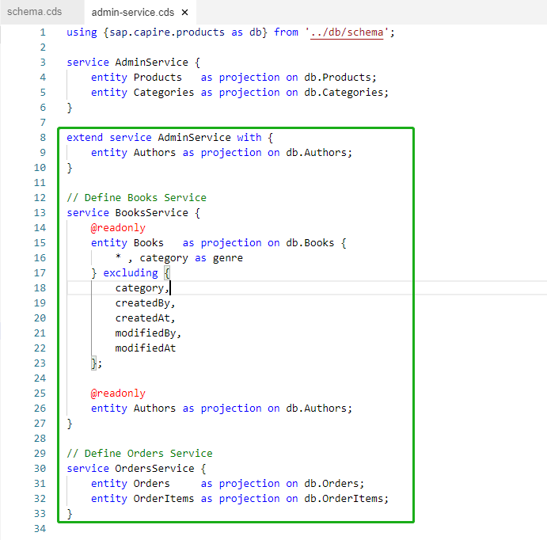

对于上述代码片段：

- 新建BooksService用于创建只读视图，该视图基于`Books`和`Authors`，且该视图只可读取不可变更
- 新建OrdersService允许查看、创建、删除orders
- 我们重用了AdminService，在重用的基础上我们为其引入了新的实体`Authors`

### 重新部署sqlite数据库

在`product-service`项目根目录下执行以下命令，将data model部署到sqlite数据库：

```sh
npm install --save sqlite3
#您也可以自定义生成目标db的路径
cds deploy --to sqlite:db/product.db #在db目录下生成my.db
```

### 运行应用查看服务和实体

在`product-service`项目根目录下执行`mvn spring-boot:run`启动应用，应用启动完成之后查看新建的实体和服务是否发布成功：

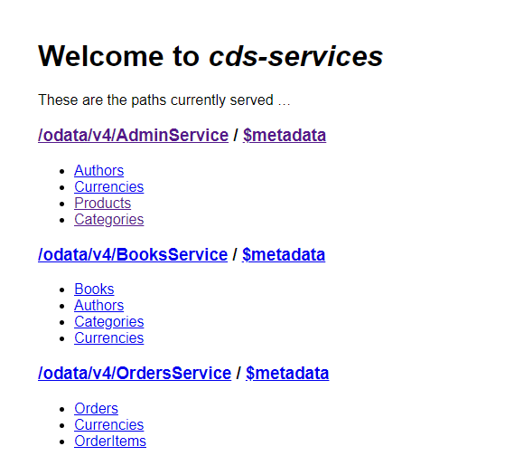

## 安装sqlite工具

在之前的步骤中，我们通过命令行的方式可以查看sqlite数据库中的实体对应的表结构，但是我们希望有更加灵活的方式来帮助我们查看数据库中表结构。为此，您可以选择通过在SBAS中安装扩展插件的形式来使用sqlite工具。

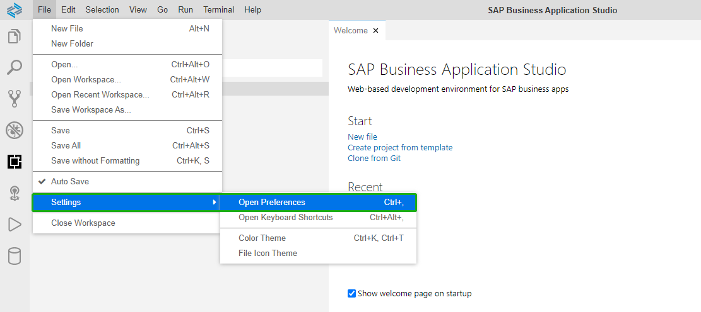

:point_right: 在SBAS中：点击`File > Settings > Open Preferences`,在**Sqltools**条目下，点击链接`Edit in settings.json`。

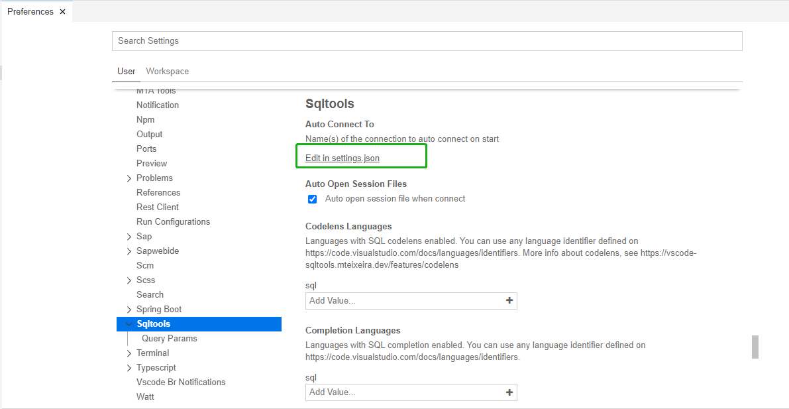

:point_right: 在打开的settings.json文件末尾添加配置：

```yaml
"sqltools.connections": [
    {
        "name": "sqlite",
        "dialect": "SQLite",
        "database": "/home/user/projects/products-service/db/product.db"
    }
]
```

**注意**: 请确保上述配置项中的`database`的值必须与您的sqlite数据库文件所在路径相符。

添加完的效果如下：

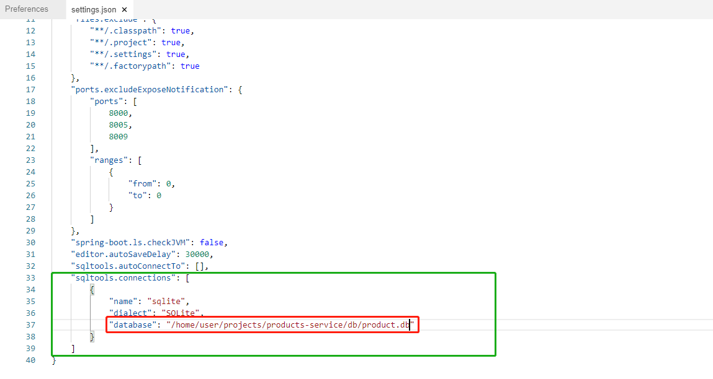

:point_right: 添加完成之后，点击打开左侧`SQLTools面板`：

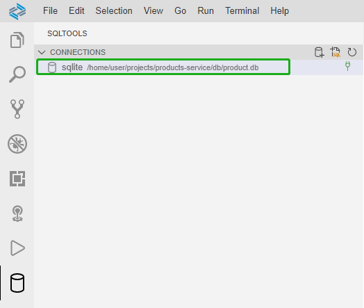

:point_right: 双击面板中的对应的数据库连接，附加到sqlite数据库上。您将看到数据库图形界面化的面板，在面板中可以执行相关数据库记录的查询动作。

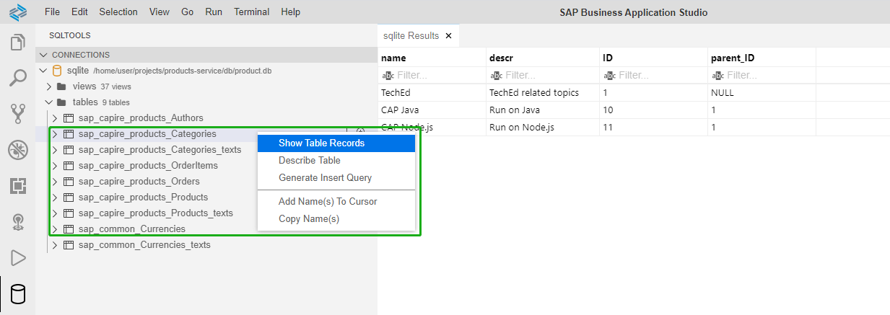

## 创建测试数据

添加完新的实体和服务之后，我们即将开始测试我们的应用，现在我们即将添加测试数据来测试应用实体和服务。

:point_right: 在之前创建的`product-service`项目中，右键点击**db**目录，选择`New Folder`,在新弹出的窗口中，为该目录命名为**data**。

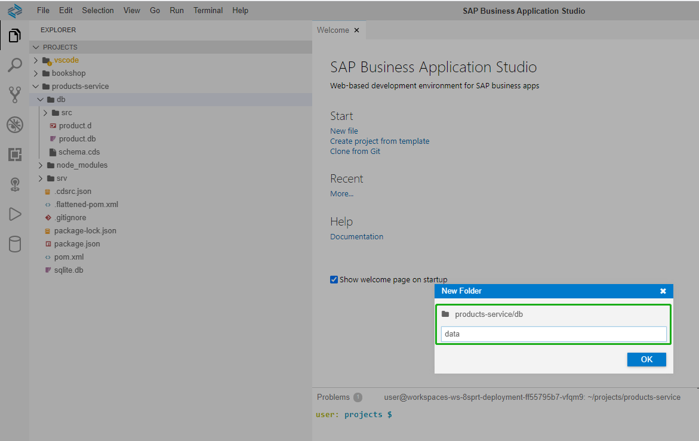

### 下载测试数据

:point_right: 执行以下命令下载测试数据所在仓库：

```sh
cd ~/projects/
git clone https://github.com/HuangMarco/cap-samples-data.git
```

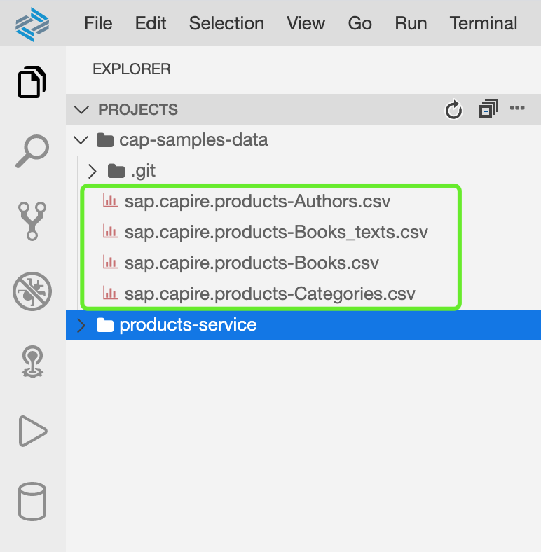

<!-- 
:point_right: 在`product-service/db/data`目录下执行以下命令：

```sh
## 下载
curl -o sap.capire.products-Authors.csv https://raw.githubusercontent.com/SAP-samples/cloud-cap-samples/CAA160-final/bookstore/db/data/sap.capire.bookstore-Authors.csv

curl -o sap.capire.products-Books.csv https://raw.githubusercontent.com/SAP-samples/cloud-cap-samples/CAA160-final/bookstore/db/data/sap.capire.bookstore-Books.csv

curl -o sap.capire.products-Books_texts.csv https://raw.githubusercontent.com/SAP-samples/cloud-cap-samples/CAA160-final/bookstore/db/data/sap.capire.bookstore-Books_texts.csv

curl https://raw.githubusercontent.com/SAP-samples/cloud-cap-samples/CAA160-final/bookstore/db/data/sap.capire.products-Categories.csv -O
``` -->

选中样例仓库中的4个文件，将这4个文件**拖动**到`products-service`中的`db/data`目录。

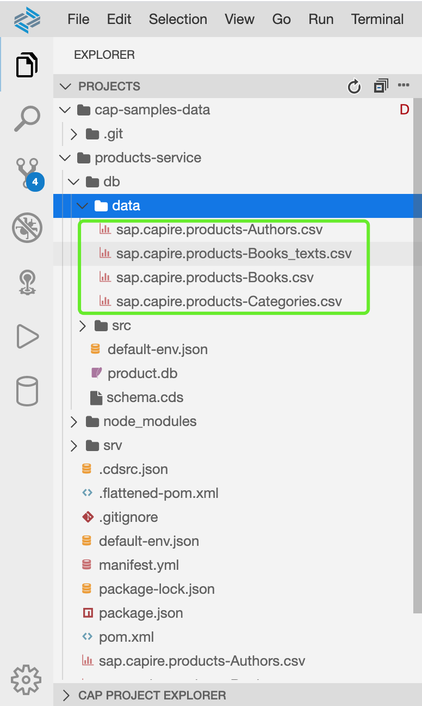

### 重新部署数据库

:point_right: 在`product-service`项目根目录下运行以下命令重新部署数据库，以便于将测试数据部署到数据库中：

```sh
#您也可以自定义生成目标db的路径
cds deploy --to sqlite:db/product.db #在db目录下生成my.db
```

### sqlite工具面板查看测试数据

#### 查看Authors数据

:point_right: 附加到sqlite数据库之后，点击下拉箭头展开`tables栏`：

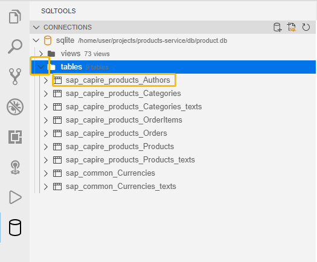

:point_right: 右键点击`sap_capire_products_Authors`，选择`Show Table Records`查看数据库记录：

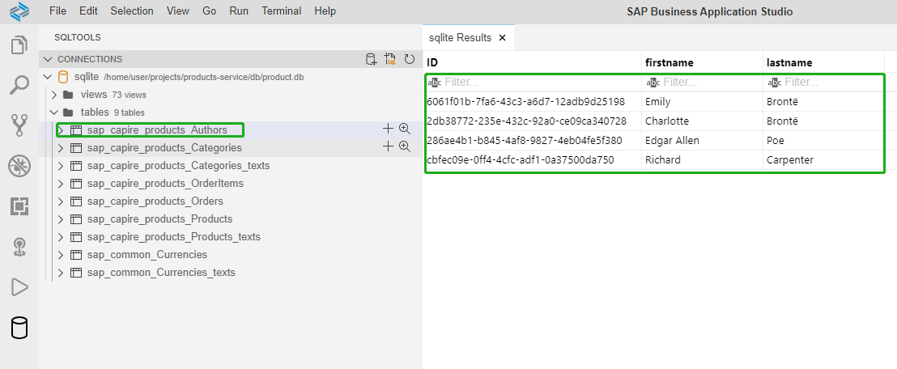

#### 查看Categories数据

按照上述同样操作，查看`sap_capire_products_Categories`数据：

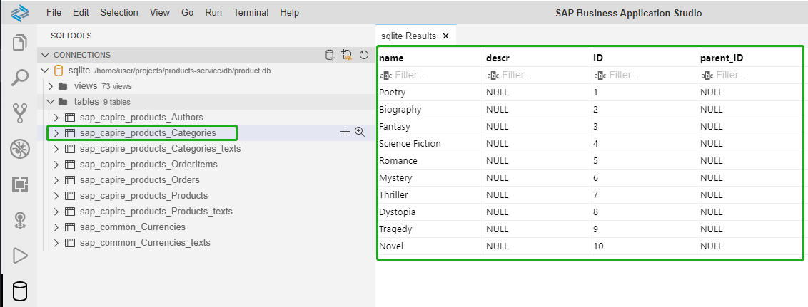

#### 查看Products数据

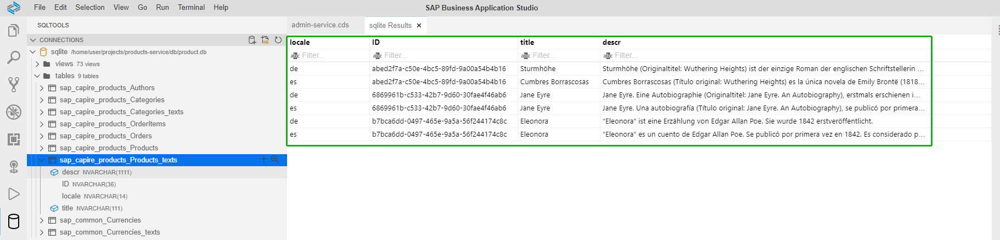

#### 查看视图Books数据

按照上述类似操作，在**views**栏目中，查看Books视图中的数据

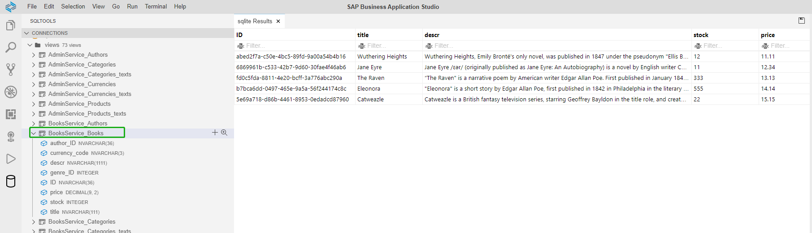

至此，我们通过部署测试数据文件的方式，可以将我们的测试数据部署到数据库中。SAP CAP提供灵活的测试数据加载方式。接下来我们将通过[08-配置应用使用SAP HANA数据库](https://github.com/HuangMarco/teched-2020-sap-cap/blob/master/exercises/08/README.md)消费位于SAP云平台中的HANA数据库服务。
