# 08-配置应用使用SAP HANA数据库

SAP HANA数据库是一种高可用的内存数据库。是SAP技术业务平台的数据基础，SAP HANA同时提供了更高级的分析特性。更多关于SAP HANA请点击[这里](https://www.sap.com/products/hana.html?btp=1fdffe5e-264a-443e-aae1-4019f2cbb792)。

## 章节目标

在本章节中，您将经历如下：

- 通过CDS命令行方式将数据部署到HANA数据库
- 在本地运行应用使用HANA数据库
- 访问应用

## 在SBAS中登录SAP云平台

SBAS与SAP云平台无缝集成，您可以在SBAS中与SAP云平台自由交互。在接下来的练习中，我们将在SBAS中登录到远端的SAP云平台。更多关于SAP云平台介绍请点击[这里](https://help.sap.com/viewer/65de2977205c403bbc107264b8eccf4b/Cloud/zh-CN/73beb06e127f4e47b849aa95344aabe1.html)。

### 登录到SAP云平台主控室

请登录[SAP云平台主控室](http://cockpit.cn40.platform.sapcloud.cn/cockpit)，如下图所示进入到您的子账户概览页面：

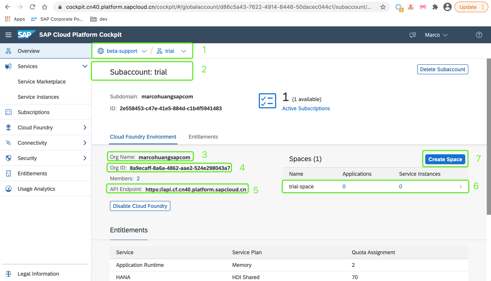

以上图为例，按照顺序：

- 1: 显示当前主控室页面处于全局账户(beta-support)下的子账户(trial)
- 2: 显示子账户名称为trial
- 3: 显示该子账户下的组织名称，该组织名称在执行登录到SAP云平台时会使用到
- 4: 显示该组织的guid
- 5: 显示该全局账户所在的API端点入口，该端口全局唯一，该API端点在执行登录到SAP云平台时会使用到
- 6: 显示当前组织下的空间名称，一个组织下可以有多个空间，该空间名称在执行登录到SAP云平台时会使用到
- 7: 点击该按钮可创建新的空间

在本练习中，我们已默认为您创建了名为`trial-space`的空间，所以您无需再次创建新的空间。

### 配置登录SAP云平台

:point_right: 在SBAS左侧底部状态栏中，以背景色蓝色显示当前SBAS所连接的SAP云平台组织和空间信息。

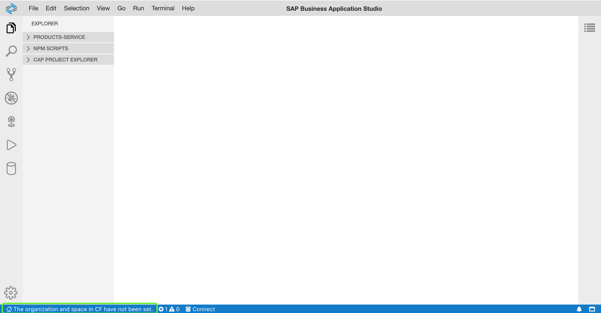

:point_right: 点击**上图**中的**绿色方框**位置，在SBAS弹出的对话框中分别输入：

- API端点信息，在本次使用到的SAP云平台环境中的默认值为：`https://api.cf.cn40.platform.sapcloud.cn`

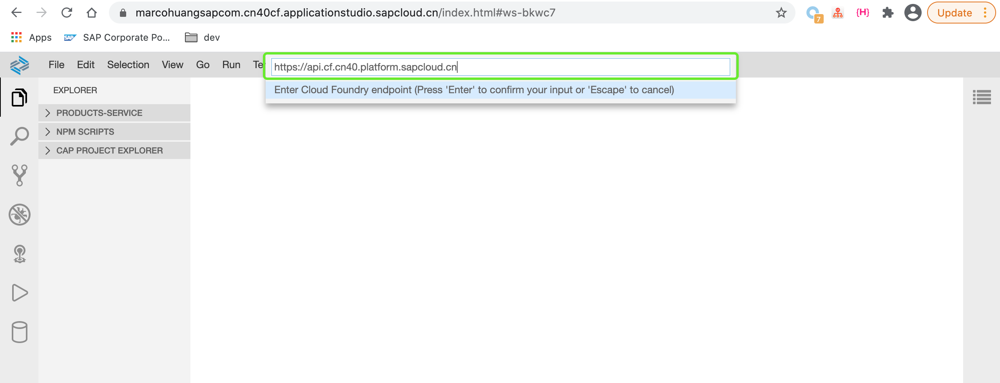

- 邮箱账户，即我们为您分配SAP云平台访问权限的账户名称

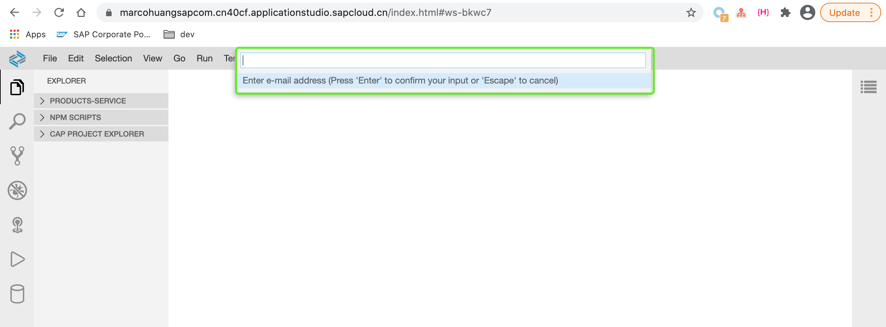

- 密码，访问SAP云平台账户对应的密码

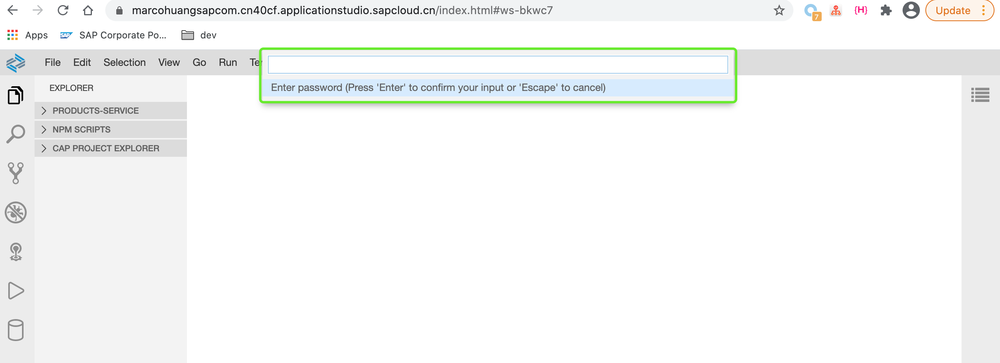

- SAP云平台子账户下的组织名称，即在上一步骤提到的条目3

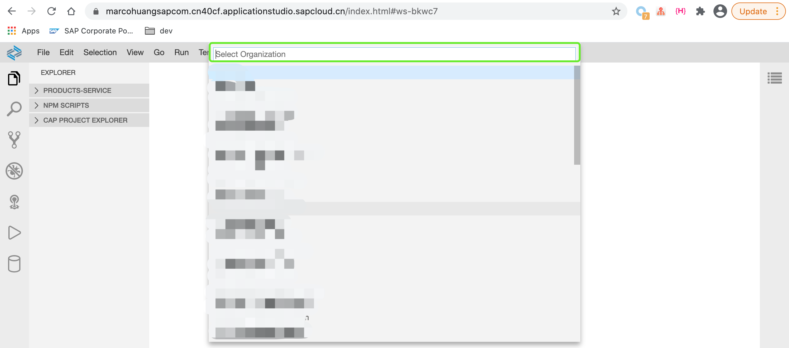

- SAP云平台子账户下的组织中的空间名称，即在上一步骤提到的条目6

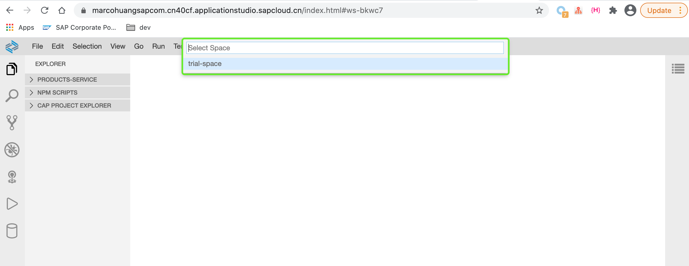

设置成功后，SBAS会在右侧底部弹出消息显示您已成功设置SAP云平台组织和空间。

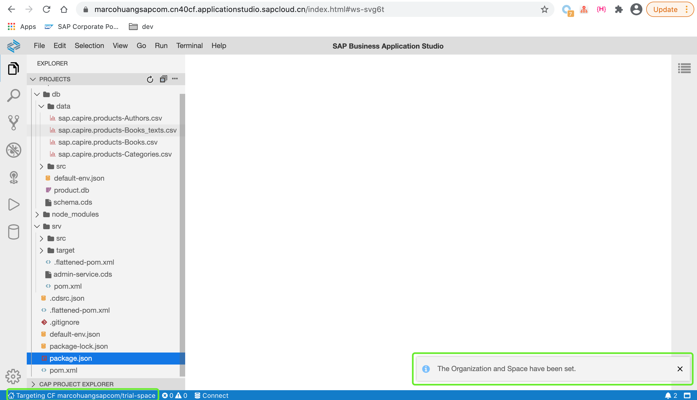

至此，您已完成在SBAS中登录到SAP云平台。

## 部署CDS实体到SAP HANA数据库

在SBAS中，默认已为我们预先安装好了与SAP云平台相关的集成工具，比如使用云平台的[Cloud Foundry Command Line Interface](https://docs.cloudfoundry.org/cf-cli/install-go-cli.html)。您无需再次安装该工具，即可在任意一个终端中执行`cf 命令`与SAP云平台进行交互。

### 安装相关的nodejs依赖

:point_right: 在终端中切换到`product-service`项目根目录，同时执行以下命令：

```sh
npm install --save @sap/hdi-deploy # 安装和sap hana相关的依赖
```

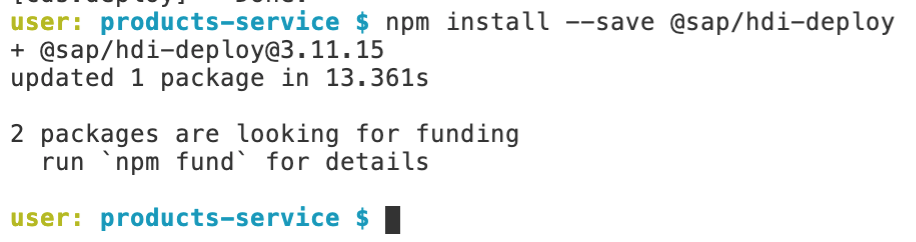

### 部署cds实体到SAP云平台中的HANA数据库

:point_right: 执行以下命令将同时创建SAP HANA服务实例，同时将应用中的实体单元部署到运行在SAP云平台中的HANA数据库服务中。在云平台中，一切皆以服务的方式对外提供。

```sh
cds deploy --to hana:product-hana-service
```

- product-hana-service：我们即将使用到的SAP HANA服务实例名称。第一次执行部署动作时，若云平台检测到子账户下并没有同名的服务实例，那么云平台将会先创建该服务实例，并以输入的实例名称命名该新实例。

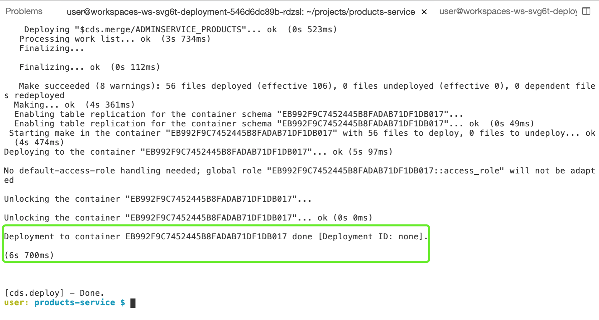

### 以命令行方式与云平台交互

前面提到，在SBAS中已默认与SAP云平台集成。我们可以在任意打开的终端中输入`cf`相关命令来查看子账户下的相关信息。

:point_right: 在任意打开的终端中，执行以下命令：

```sh
cf services # 您也可以通过cf s以别名的方式执行命令，该命令效果等同于cf services
```

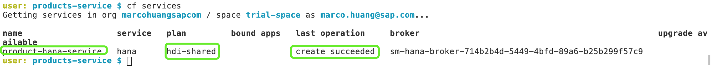

可见，我们在我们的子账户下，一个名称为`product-hana-service`的SAP HANA数据库服务实例被成功创建，该服务使用的服务计划为`hdi-shared`。

## 配置应用在本地使用SAP HANA数据库服务

在上一步骤中我们创建并配置使用了SAP HANA数据库服务实例。观察应用您会发现在应用中多了2个`default-env.json`。

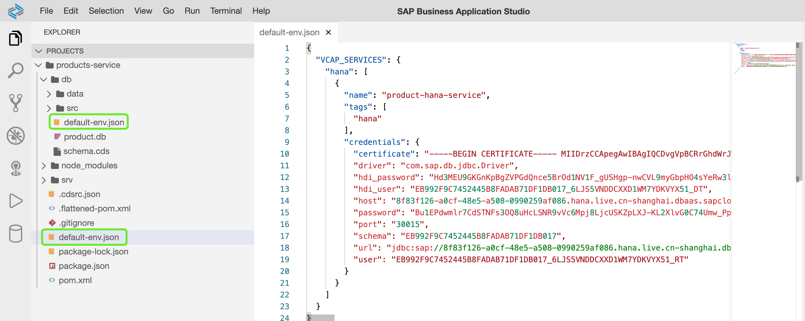

查看该文件会发现，其包含与应用相关的环境变量信息。SAP HANA数据库服务相关的信息，例如`jdbc驱动名称`、`访问云平台HANA实例的用户名以及密码`、`云平台HANA服务实例主机地址`等信息均以环境变量方式被配置到应用中。接下来应用会读取该文件中相关信息，同时利用这些信息连接远端的SAP云平台中的HANA数据库服务实例。

### 添加cds hana依赖

在前面的步骤中我们只是将应用中的cds实体部分部署到SAP HANA数据库中，现在我们需要配置应用部分，添加以下依赖使得应用从SAP云平台的HANA数据库服务中读取数据。

:point_right: 打开位于目录`srv`下的`pom.xml`文件，在`<dependencies>`标签内添加如下依赖：

```xml
<dependency>
    <groupId>com.sap.cds</groupId>
    <artifactId>cds-feature-hana</artifactId>
</dependency>
```

:point_right: 在应用根目录下执行以下命令启动应用：

```sh
mvn spring-boot:run -Dspring-boot.run.profies=cloud
```

其中：

- -Dspring-boot.run.profies=cloud，确保我们在本地运行应用激活的是spring boot应用中cloud命名空间下的配置，这样就不会调用`application.yaml`中我们之前配置的sqlite数据库。

### 访问应用

:point_right: 开启另外一个终端，并在其中执行以下命令访问SBAS本地启动的应用:

```sh
curl -X POST http://localhost:8080/odata/v4/OrdersService/Orders \
-H "Content-Type: application/json" \
-d '{ "currency_code": "USD", "items": [ { "book_ID": "b7bca6dd-0497-465e-9a5a-56f244174c8c", "amount": 1 } ] }'
```

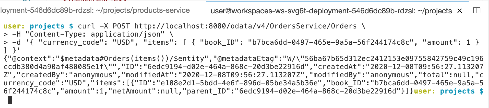

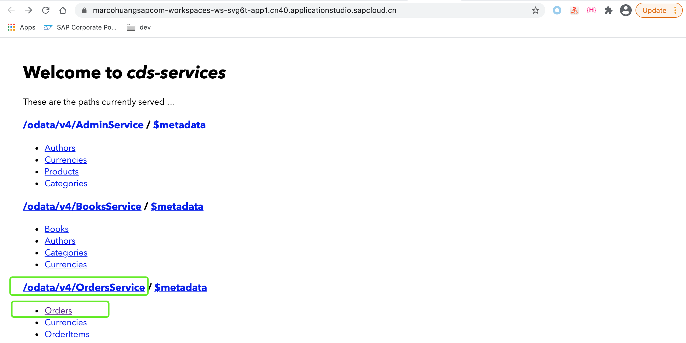

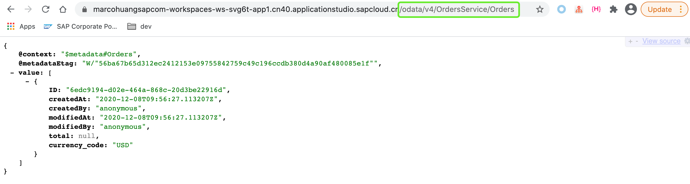

至此，我们已成功的配置并使用了SAP云平台中的HANA数据库服务。接下来我们即将完成最后一个练习[09-部署应用到SAP云平台](https://github.com/HuangMarco/teched-2020-sap-cap/blob/master/exercises/09/README.md)。

