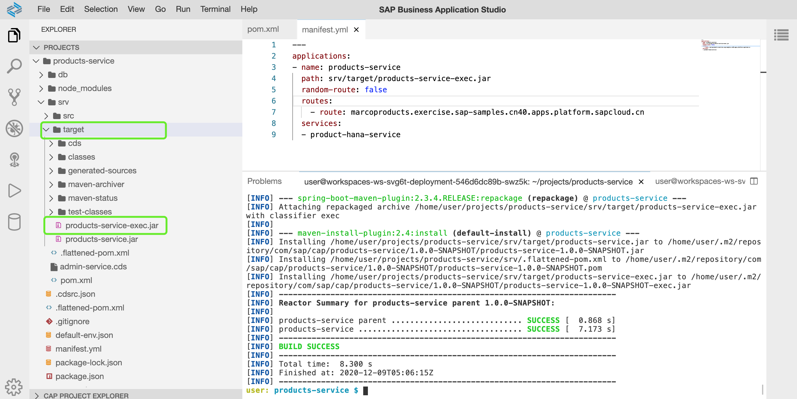
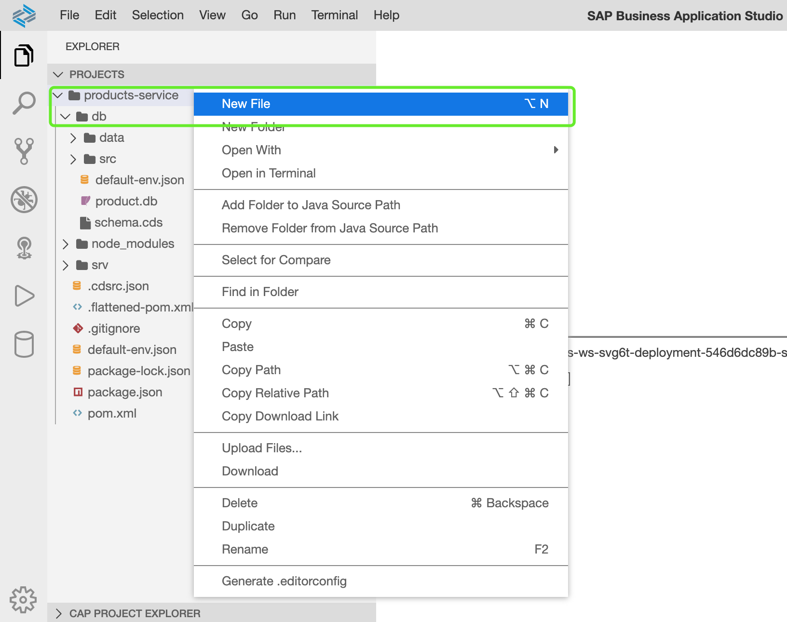
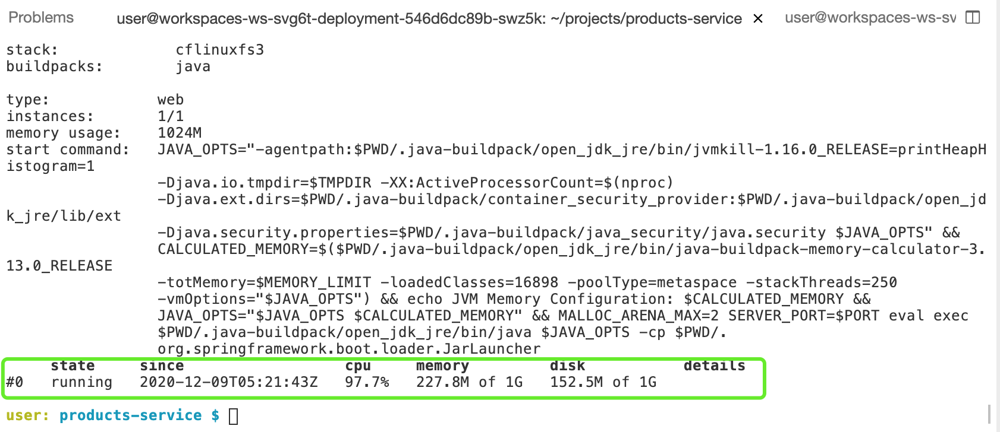
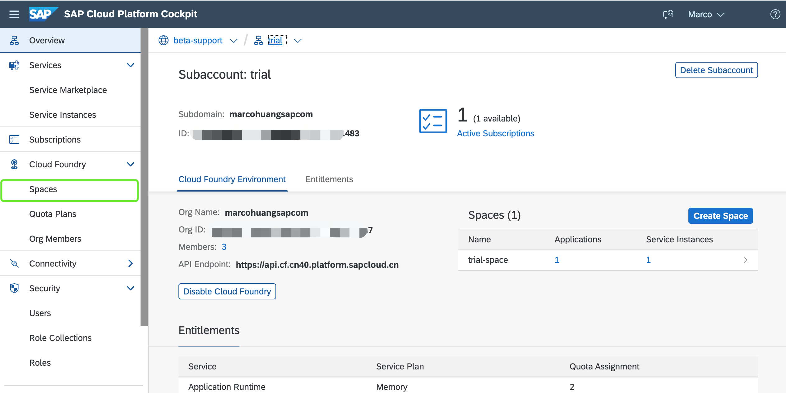
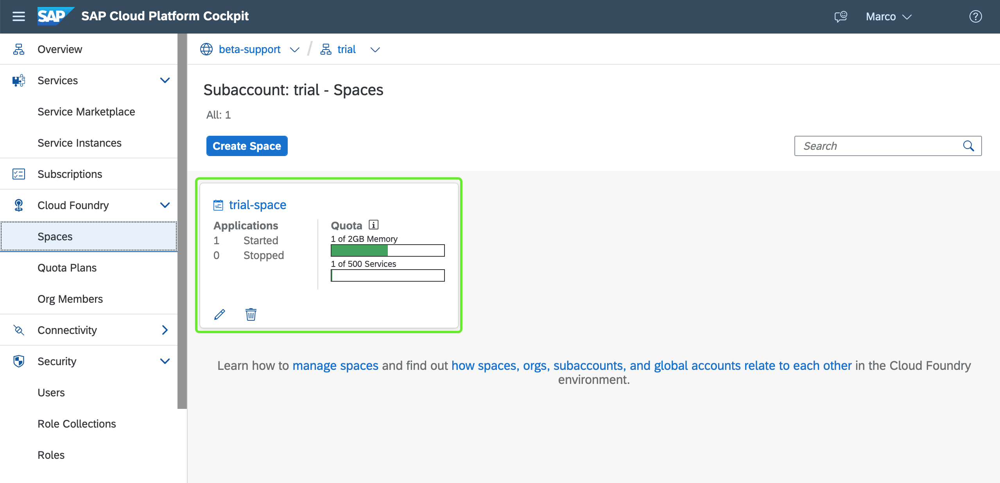
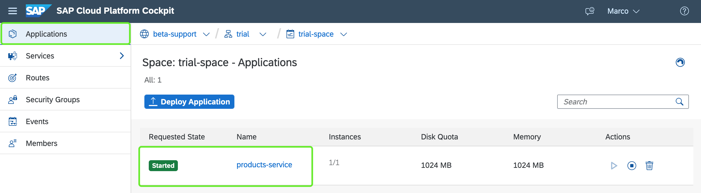
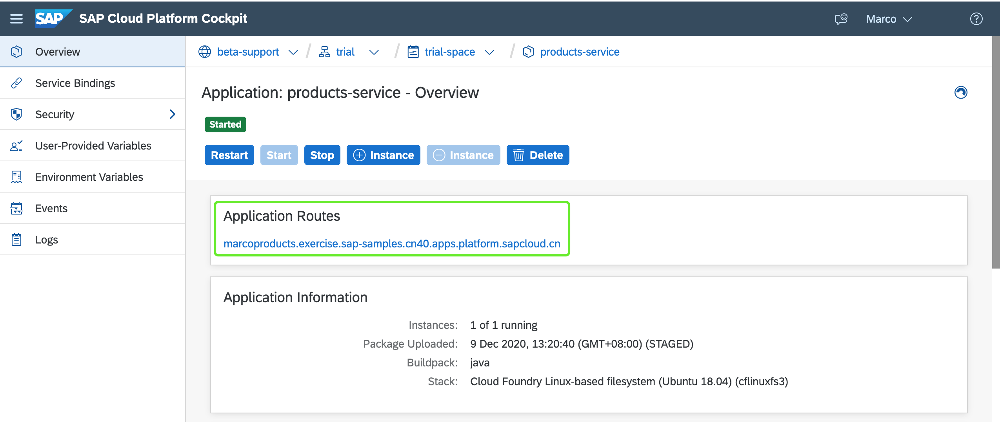
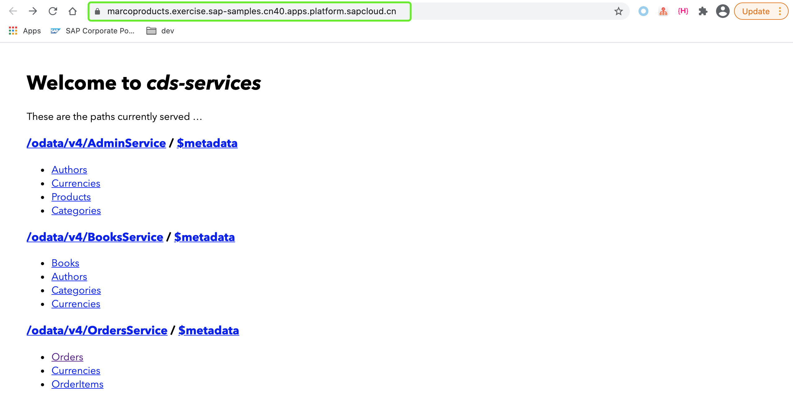

# 09-部署应用到SAP云平台

在上一章节中，我们已完成：

- 将应用的实体部分部署到了位于SAP云平台的HANA数据库服务中
- 在SBAS本地运行应用使用HANA数据库服务

在接下来的章节内容中，我们即将完成此次培训中的最后一个步骤，即部署我们的应用到SAP云平台。

## 章节目标

- 部署应用到SAP云平台

## 编译项目

:point_right: 在`product-service`项目根目录下执行命令`mvn clean install`对项目进行编译。



编译完成之后，在项目路径`srv/target/`下可见编译产出的jar包`products-service-exec.jar`。

## 创建清单文件

配置清单文件可以让应用可持续可重复性的部署到SAP云平台。在清单文件中可定义与应用相关的指标参数，以及应用所使用到的相关的云服务。每次部署到云平台都会调用清单文件，同时检索清单文件中的参数，通过命令`cf push`命令调用清单文件对应用进行部署。

更多关于清单文件，请点击[这里](https://docs.cloudfoundry.org/devguide/deploy-apps/manifest.html)。

:point_right: 在**应用根目录**创建文件`manifest.yml`。



:point_right: 为新建的`manifest.yml`添加如下内容：

```yml
---
applications:
- name: products-service
  path: srv/target/products-service-exec.jar
  random-route: false
  routes:
    - route: marcoproducts.exercise.sap-samples.cn40.apps.platform.sapcloud.cn
  services:
  - product-hana-service
```

- `name`: 部署到SAP云平台之后的目标应用名称
- `path`: 部署到SAP云平台的应用的jar包
- `route`: 其中`exercise.sap-samples.cn40.apps.platform.sapcloud.cn`是当前云平台中预先为您分配好的域名，请用自定义前缀以替换样例中的`marcoproducts`，即**自定义主机名.exercise.sap-samples.cn40.apps.platform.sapcloud.cn**。
- `product-hana-service`: 在上一章节[08-配置应用使用SAP HANA数据库](https://github.tools.sap/sap-samples-scpcn/teched-2020-12-15/blob/dev/exercises/08/README.md)我们创建的SAP云平台HANA数据库服务实例

### 域名和路由

每一个部署到云平台的应用都需要有唯一一个路由与之匹配，外部请求通过路由找到运行在云平台中的应用地址。路由是由域名(domain name)和主机名称(host name)组成。应法律法规要求，运行在云平台中的应用的域名必须经过备案，您需要为您的应用准备相对应的域名地址。

更多关于云平台域名和路由请点击[这里](https://docs.cloudfoundry.org/devguide/deploy-apps/routes-domains.html)。

## 配置应用依赖

云平台通过调用Open Service API来为应用提供服务。当应用部署到云平台之后，一个名称为`VCAP_SERVICES`的环境变量将会被创建并赋予给应用，该环境变量包含所有应用使用到的相关服务的凭据。CAP会自动读取该环境变量，并从中提取与所使用的云平台服务相关的参数，以便于让应用在云平台连接并使用云平台中的服务。

我们需要添加相关依赖以便于让CAP能够达成上述功能。

:point_right: 打开位于目录**srv**下的`pom.xml`文件，添加如下依赖：

```xml
<dependency>
    <groupId>com.sap.cds</groupId>
    <artifactId>cds-feature-cloudfoundry</artifactId>
</dependency>
```

:point_right: 在应用根目录中执行命令`mvn clean install`以编译应用。

## 部署应用到SAP云平台

:point_right: 在应用根目录执行命令`cf push`。`cf`命令会自动检索`manifest.yml`，通过读取该配置文件中的参数，找到对应的应用jar包，并将其推送到SAP云平台。



如上图所示，应用也成功推送到SAP云平台，同时状态为running。

## SAP云平台主控室中查看应用

登录到[SAP云平台主控室](http://cockpit.cn40.platform.sapcloud.cn/cockpit)，在左侧栏目中点击`Spaces`进入到子账户组织空间内。





点击组织空间面板进入到应用面板。



如上图所示，当前子账户组织空间内的所有应用都会以列表形式显示在面板中。继续点击应用`products-service`链接进入应用详细信息页面。



如上图所示，在应用详细信息页面您可以停止、重启、扩容应用。点击应用路由链接打开新浏览器标签页访问应用。



如上图所示，我们的应用可通过浏览器在外部访问。至此我们已成功的将应用发布到SAP云平台！